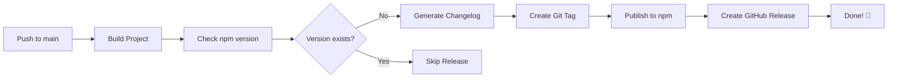

# ✅ GitHub Automation Setup Complete!

## 🎉 What's Been Configured

Your BitPaper project now has professional-grade automated publishing and changelog generation!

## 📦 Files Created/Modified

### Core Workflows
- ✅ `.github/workflows/publish.yml` - **UPDATED** with best practices
- ✅ `.github/workflows/sync-labels.yml` - **NEW** automatic label sync
- ✅ `.github/workflows/ci.yml` - Existing CI workflow

### Configuration Files
- ✅ `.github/release.yml` - **NEW** release notes configuration
- ✅ `.github/labels.yml` - **NEW** label definitions (40+ labels)
- ✅ `CHANGELOG.md` - **NEW** changelog file
- ✅ `package.json` - **UPDATED** to include CHANGELOG.md

### Documentation
- ✅ `.github/RELEASE_PROCESS.md` - **NEW** comprehensive release guide
- ✅ `.github/PULL_REQUEST_TEMPLATE.md` - **NEW** PR template
- ✅ `.github/WORKFLOWS.md` - **NEW** automation overview
- ✅ `CONTRIBUTING.md` - Existing (already has commit conventions ✓)

## 🚀 Key Improvements

### 1. Fixed npm Publishing Issues ✓

**Before:**
```yaml
run: npm publish
```

**After:**
```yaml
run: npm publish --provenance --access public
env:
  NODE_AUTH_TOKEN: ${{ secrets.NPM_TOKEN }}
```

**Changes:**
- ✅ Added `NODE_AUTH_TOKEN` environment variable (critical!)
- ✅ Added `--provenance` for supply chain security
- ✅ Added `--access public` to ensure public publishing
- ✅ Better version checking (checks npm registry instead of git diff)

### 2. Automated Changelog Generation ✓

**Features:**
- 🤖 Automatic changelog from commit messages
- 🏷️ PR label categorization
- 👥 Contributor credits
- 🔗 Automatic GitHub comparison links
- 📝 Conventional commit parsing

**Example Output:**
```markdown
## 🚀 Features
- Add Cardano blockchain support by @contributor in #123

## 🐛 Bug Fixes
- Fix Bitcoin address validation by @maintainer in #124
```

### 3. Enhanced Release Process ✓

**Automated Steps:**
1. ✅ Build project
2. ✅ Check if version exists on npm
3. ✅ Generate changelog from commits + PRs
4. ✅ Create git tag
5. ✅ Publish to npm with provenance
6. ✅ Create GitHub release with beautiful notes
7. ✅ Include installation instructions
8. ✅ Link to npm package

### 4. Label System ✓

**40+ Labels organized by:**
- 🚀 Features (`feature`, `feat`, `enhancement`)
- 🐛 Bugs (`bug`, `fix`, `bugfix`)
- 📚 Documentation (`docs`, `documentation`)
- 🔧 Maintenance (`chore`, `refactor`, `test`)
- 🔐 Security (`security`)
- ⚡ Performance (`perf`, `performance`)
- 🎨 UI/UX (`ui`, `ux`, `design`)
- 🏷️ Workflow (`wip`, `good first issue`, `help wanted`)

## 🔧 What You Need to Do

### Step 1: Fix npm Token (CRITICAL!)

Your current npm token isn't working because it's the wrong type.

**Create an Automation Token:**

1. Go to [npmjs.com](https://www.npmjs.com/) and log in
2. Click your profile → **Access Tokens**
3. Click **Generate New Token** → Select **Automation** (not Publish!)
4. Name it "GitHub Actions"
5. Copy the token (starts with `npm_...`)

**Update GitHub Secret:**

1. Go to https://github.com/yhauxell/bitpaper/settings/secrets/actions
2. Find `NPM_TOKEN` and click **Update**
3. Paste your new automation token
4. Save

> **Why Automation token?** It works in CI/CD without 2FA prompts!

### Step 2: Sync Labels (Optional)

Run the label sync workflow manually:

1. Go to https://github.com/yhauxell/bitpaper/actions
2. Click "Sync Labels" workflow
3. Click "Run workflow"

Or just push the changes - it will run automatically!

### Step 3: Test the Workflow

```bash
# Bump version
npm version patch  # 0.0.10 → 0.0.11

# Push to trigger workflow
git push origin main

# Watch it work!
# Go to: https://github.com/yhauxell/bitpaper/actions
```

## 📋 How to Release (Simple!)

From now on, releasing is just 2 commands:

```bash
# 1. Bump version (patch/minor/major)
npm version patch

# 2. Push
git push origin main

# That's it! 🎉
# - Changelog generated automatically
# - Published to npm automatically  
# - GitHub release created automatically
# - Git tag created automatically
```

## 🎯 Commit Convention

Use these prefixes for automatic categorization:

```bash
feat: add new feature           # → 🚀 Features section
fix: fix a bug                  # → 🐛 Bug Fixes section
docs: update documentation      # → 📚 Documentation section
chore: maintenance tasks        # → 🧰 Maintenance section
perf: improve performance       # → ⚡ Performance section
security: security improvement  # → 🔐 Security section
```

**Examples:**
```bash
git commit -m "feat: add Polkadot (DOT) blockchain support"
git commit -m "fix: correct Ethereum address validation"
git commit -m "docs: improve plugin development guide"
```

## 📊 What Happens on Each Release



## 🎁 Bonus Features

### Supply Chain Security
- ✅ npm provenance enabled (cryptographic attestation)
- ✅ Shows verified source on npm package page

### Better Permissions
- ✅ `contents: write` - for creating tags
- ✅ `id-token: write` - for npm provenance

### Improved Version Checking
- ✅ Checks npm registry (more reliable)
- ✅ Prevents accidental republishing

### Professional Release Notes
- ✅ Auto-generated from commits & PRs
- ✅ Categorized by type
- ✅ Includes contributors
- ✅ Links to full changelog
- ✅ Installation instructions

## 📚 Documentation

All documentation is ready:
- **[RELEASE_PROCESS.md](.github/RELEASE_PROCESS.md)** - Detailed release guide
- **[CONTRIBUTING.md](CONTRIBUTING.md)** - Contribution guidelines  
- **[WORKFLOWS.md](.github/WORKFLOWS.md)** - Automation overview
- **[CHANGELOG.md](CHANGELOG.md)** - Project changelog

## ✨ Example Release

After you fix the npm token and push:

**On npm:** https://www.npmjs.com/package/bitpaper
- ✅ New version published
- ✅ Provenance attestation visible
- ✅ Published via GitHub Actions

**On GitHub:** https://github.com/yhauxell/bitpaper/releases
- ✅ Beautiful release notes
- ✅ Categorized changes
- ✅ Installation instructions
- ✅ Link to npm package

## 🐛 Troubleshooting

### "Authentication failed to npm"
→ **Solution:** Create an Automation token (see Step 1 above)

### "Version already published"  
→ **Solution:** Bump version with `npm version patch`

### "Permission denied creating tag"
→ **Solution:** Already fixed! Workflow has `contents: write`

### Changelog is empty
→ **Solution:** Use conventional commits (`feat:`, `fix:`, etc.)

## 🎯 Next Steps

1. ✅ Fix npm token (Step 1 above)
2. ✅ Commit these changes
3. ✅ Push to main
4. ✅ Test the workflow
5. 🎉 Enjoy automated releases!

## 📞 Need Help?

- 📖 Read [RELEASE_PROCESS.md](.github/RELEASE_PROCESS.md)
- 💬 Open a GitHub Discussion
- 🐛 Check GitHub Actions logs
- 📧 Email: yhauxell@gmail.com

---

**🎉 Congratulations!** Your project now has professional CI/CD automation!

